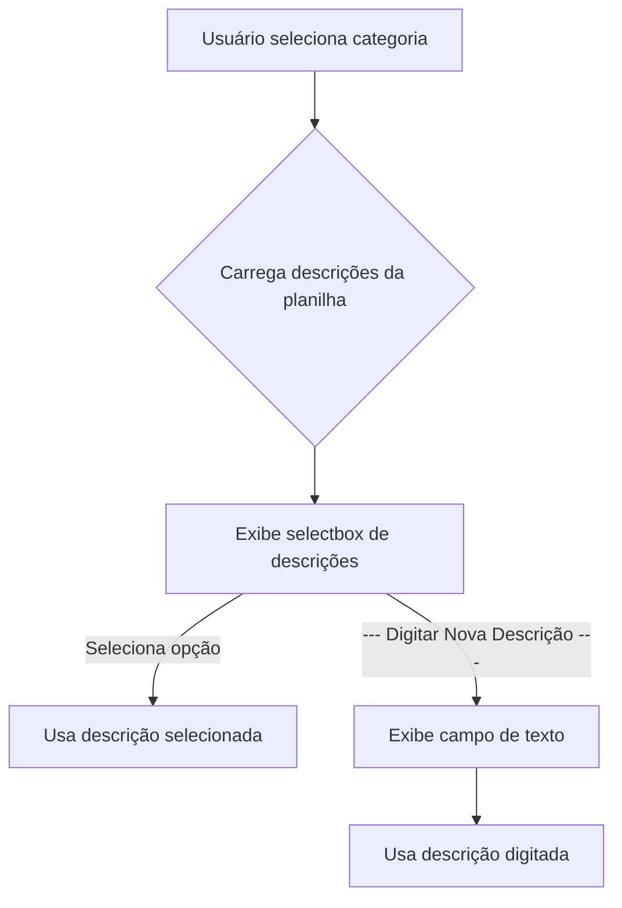

# Campo Descrição Dinâmico no Formulário de Nova Despesa

## Objetivo
Permitir que o campo **Descrição** do formulário "Nova Despesa" seja uma lista suspensa dinâmica, baseada na categoria escolhida, buscando os valores na aba "Despesas Categoria" da planilha. Também deve permitir digitar uma nova descrição caso o item desejado não esteja na lista.

---

## Como implementar

### 1. Carregar as descrições da aba "Despesas Categoria"
- A aba "Despesas Categoria" tem as categorias como colunas e as descrições como linhas.
- Quando o usuário seleciona uma categoria, buscar todas as descrições não nulas da coluna correspondente.

### 2. Exibir as descrições como selectbox
- Após selecionar a categoria, o campo descrição será um selectbox com as opções daquela categoria.
- Adicionar ao final da lista a opção: `"--- Digitar Nova Descrição ---"`.

### 3. Permitir digitar uma nova descrição
- Se o usuário escolher `"--- Digitar Nova Descrição ---"`, exibir um campo de texto para digitar a nova descrição.
- O valor final da descrição será o selecionado no selectbox ou o digitado no campo de texto.

### 4. (Opcional) Salvar a nova descrição na planilha
- Se desejar, adicionar a nova descrição na aba "Despesas Categoria" para uso futuro.

---

## Fluxo detalhado no formulário

1. **Usuário seleciona a categoria**  
   → Carregar as descrições da coluna correspondente na aba "Despesas Categoria".

2. **Usuário seleciona a descrição**  
   → Se escolher uma das opções, usar esse valor.  
   → Se escolher `"--- Digitar Nova Descrição ---"`, mostrar um campo de texto.

3. **Usuário preenche o restante do formulário e salva**  
   → O valor da descrição é o selecionado ou o digitado.

---

## Exemplo de código (pseudo-código)

```python
# Após selecionar a categoria:
if categoria:
    descricoes = carregar_descricoes_da_planilha(categoria)  # Busca na aba "Despesas Categoria"
    descricoes.append("--- Digitar Nova Descrição ---")
    descricao = st.selectbox("Descrição", options=descricoes)
    if descricao == "--- Digitar Nova Descrição ---":
        nova_descricao = st.text_input("Nova Descrição")
        descricao_final = nova_descricao
    else:
        descricao_final = descricao
```

---

## Função para buscar descrições

```python
def carregar_descricoes_da_planilha(categoria):
    df = pd.read_excel("Base_financas.xlsx", sheet_name="Despesas Categoria")
    if categoria in df.columns:
        return [d for d in df[categoria].dropna().unique() if str(d).strip() != ""]
    return []
```

---

## Resumo visual do fluxo



---

## Vantagens desse método
- **Escalável:** Basta adicionar novas descrições na planilha, não precisa mexer no código.
- **Flexível:** Permite digitar novas descrições facilmente.
- **Organizado:** Mantém as descrições agrupadas por categoria. 